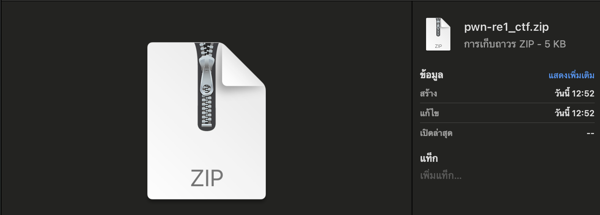
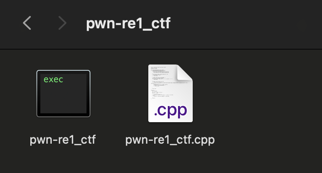
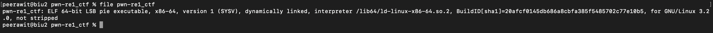

ข้อนี้โจทย์จะให้ไฟล์ zip นี้มา


ซึ่งในไฟล์จะมีไฟล์ executable และ source code มา


ที่เขาสอนๆกันมาก็คือไปเช็คไฟล์


ซึ่งมันก็คือ executable ไฟล์จริงๆนั่นแหละ อีกไฟล์ก็คือ source code

เขาอุตส่าห์ให้ source code มา เราก็ไปเปิดดูหน่อยจะดีมั้ย??

```cpp
// gcc -o pwn-re1_ctf pwn-re1_ctf.cpp -lstdc++
#include <iostream>
#include <cstring>

bool check_password(const char* input) {
    // Correct password stored as hex values
    unsigned char correct_password[] = {
        0x79, 0x66, 0x10, 0x20, 0x0c, 0xcb, 0xa9, 0x36,
        0xce, 0x6b, 0xcc, 0x1e, 0x8d, 0x77, 0x85, 0xda
    };
    
    // Check input length, FLAG{32 characters} = 38
    if (strlen(input) != 38) {
        return false;
    }

    // Compare input starting from FLAG{...}
    const char* flag_format = "FLAG{";
    if (strncmp(input, flag_format, 5) != 0 || input[37] != '}') {
        return false;
    }

    // Compare the hex part of the flag
    for (int i = 0; i < 16; ++i) {
        // Extract two hex digits at a time from the input string, skipping "FLAG{" (5 characters) and '{' (5th character)
        unsigned char value;
        sscanf(&input[5 + i * 2], "%2hhx", &value);
        if (value != correct_password[i]) {
            return false;
        }
    }

    return true;
}

int main() {
    char input[50];

    std::cout << "Enter the flag: ";
    std::cin >> input;

    if (check_password(input)) {
        std::cout << "Correct! The flag is: " << input << std::endl;
    } else {
        std::cout << "Incorrect password." << std::endl;
    }

    return 0;
}
```

ดูคร่าวๆจะมี 2 ฟังชั่น หลักๆ ก็คือ check_password กับ main

ซึ่งถ้าเราเรียนมาดี ไม่ได้นอนตะแคงเรียน เราจะรู้ว่า โปรแกรมจะเริ่มทำงานจากฟังชั่น main

โปรแกรมจะรับ input เขามาเป็น flag แล้วมันจะเอาค่าที่ user input เขามา ไปเช็คที่ฟังชั่น check_password

เรามากันต่อที่ฟังชั่น check_password
condition แรกคือจะเช็คว่า input นั้น ความยาวคือ 38 อ้ะป่าว
condition ที่สองคือเช็คว่า prefix คือ FLAG{ และ suffix คือ } อ้ะป่าว
condition ต่อๆไปก็คือจะเช็คว่า ตัวที่ (5 + i * 2) ของ Input เท่ากับ correct_password[i] อ้ะป่าว

งั้นเราก็รู้แล้วว่า correct_password นั่นแหละ คือค่าที่อยู่ใน flag เราแค่แปลงจาก hex ให้มันเป็น string ซึ่งมันก็คือ 2 ตัวที่อยู่ข้างหลังของ 0x นั่นแหละ

ก็เลยจะได้ flag คือ `FLAG{796610200ccba936ce6bcc1e8d7785da}` 💥🚀