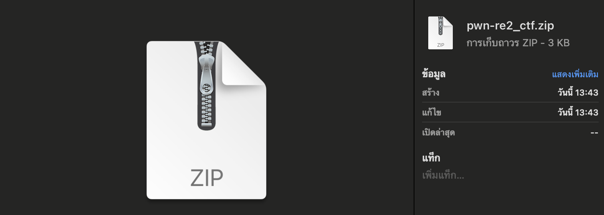
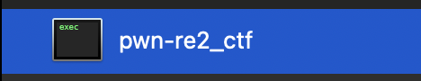
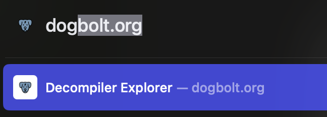
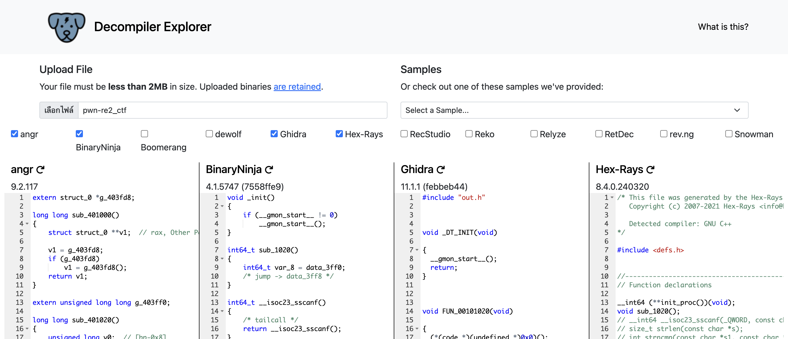
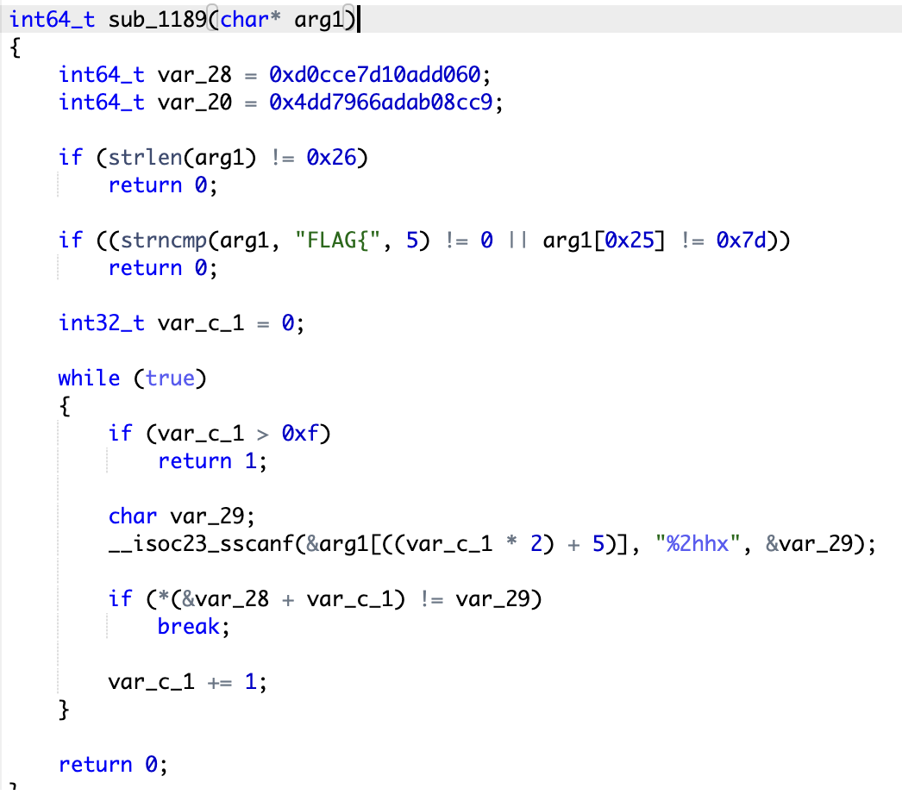
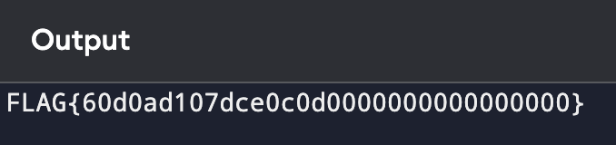
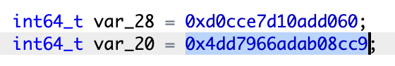
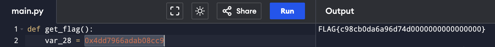

zip คนดีคนเดิม



เพิ่มเติมคือมีแค่ไฟล์ executable


ผมมุ่งหาหมาก่อนเลย


แจ๋วๆๆๆ


ซึ่งผมก็ไปเจอฟังชั่นที่จะเป็นเหมือนฟังชั่น check_password จากข้อที่แล้ว


ซึ่งผมก็อ่านไม่ค่อยออก ผมเลยโยนโค้ดนี้ลง ChatGPT ให้มันแปลงเป็น Python เพื่อให้มันอ่านง่ายขึ้น

มันแปลงมาได้แบบนี้

```python
def sub_1189(arg1: str) -> int:
    var_28 = 0xd0cce7d10add060
    var_20 = 0x4dd7966adab08cc9
    
    if len(arg1) != 38:  # 0x26 in hexadecimal is 38 in decimal
        return 0
    
    if not arg1.startswith("FLAG{") or arg1[-1] != '}':
        return 0
    
    var_c_1 = 0
    
    while True:
        if var_c_1 > 15:  # 0xf in hexadecimal is 15 in decimal
            return 1
        
        try:
            var_29 = int(arg1[(var_c_1 * 2) + 5:(var_c_1 * 2) + 7], 16)
        except ValueError:
            return 0
        
        if (var_28 >> (var_c_1 * 8) & 0xff) != var_29:
            return 0
        
        var_c_1 += 1

    return 0
```

ซึ่งผมก็ขี้เกียจจะเข้าใจอีก ก็เลยบอกมันว่า หาวิธีเอา flag ให้หน่อย

```python
def get_flag():
    var_28 = 0xd0cce7d10add060
    flag_prefix = "FLAG{"
    flag_suffix = "}"

    # Extract bytes from var_28
    flag_bytes = [(var_28 >> (i * 8)) & 0xff for i in range(16)]
    
    # Convert bytes to hexadecimal string
    flag_hex = ''.join(f"{byte:02x}" for byte in flag_bytes)
    
    # Format the flag in the expected format
    flag = flag_prefix + flag_hex + flag_suffix
    return flag

# Get the flag
print(get_flag())
```

เย่🥳

ซึ่งเหมือนว่าค่าใน flag จะมีแค่ส่วนหน้า



ซึ่งผมก็จำได้ว่ามันจะมีอีกค่านึง ผมก็เลยเดาว่า มันคงเป็นส่วนหลังแหละมั้ง



ผมก็เอามาเปลี่ยน



นี่น่าจะเป็นส่วนหลังที่เราตามหา แล้วผมก็เอามาต่อกัน

จะได้ flag เป็น

`FLAG{60d0ad107dce0c0dc98cb0da6a96d74d}`

"No theory, just เดาคับเบบี๋" 