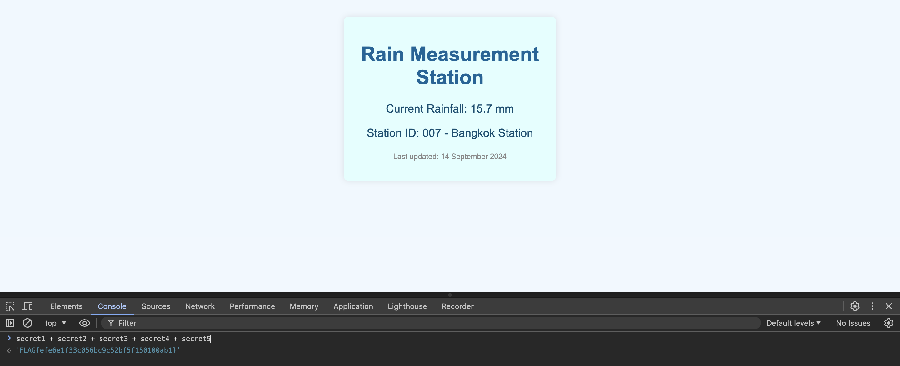

โจทย์นี้ ให้เป็นไฟล์ html มา ไฟล์เดียวมาเดี่ยวๆ เลย

```html
<!DOCTYPE html>
<html lang="en">
<head>
    <meta charset="UTF-8">
    <meta name="viewport" content="width=device-width, initial-scale=1.0">
    <title>Rain Measurement Station</title>
    <style>
        body {
            font-family: Arial, sans-serif;
            background-color: #f0f8ff;
            color: #333;
            text-align: center;
            padding: 20px;
        }

        .container {
            width: 300px;
            margin: 0 auto;
            padding: 20px;
            background-color: #e0ffff;
            border-radius: 8px;
            box-shadow: 0 0 10px rgba(0, 0, 0, 0.1);
        }

        h1 {
            color: #006699;
        }

        .data {
            font-size: 18px;
            margin-top: 10px;
            color: #005073;
        }

        .footer {
            margin-top: 20px;
            font-size: 12px;
            color: #888;
        }
    </style>
</head>
<body>

    <div class="container">
        <h1>Rain Measurement Station</h1>
        <p class="data">Current Rainfall: <span id="rainfall-data">15.7 mm</span></p>
        <p class="data">Station ID: 007 - Bangkok Station</p>
        <p class="footer">Last updated: 14 September 2024</p>
    </div>

    <!-- CTF Hint: Sometimes data might be stored where users cannot see it... -->
    
    <script>
        const rainfallData = document.getElementById('rainfall-data');
        rainfallData.innerText = "Fetching data...";
        function _0x3d61(_0x4b5b6b,_0x4dd8bc){var _0x52f52a=_0x351f();return _0x3d61=function(_0x5eafe7,_0x58818b){_0x5eafe7=_0x5eafe7-0x104;var _0x28f75e=_0x52f52a[_0x5eafe7];return _0x28f75e;},_0x3d61(_0x4b5b6b,_0x4dd8bc);}var _0x4ec9ed=_0x3d61;function _0x351f(){var _0x5bd222=['search','6060lknvWt','2772922fSsJwp','info','STH_PENTEST','0ab1}','constructor','6746964ublidH','table','(((.+)+)+)+$','FLAG{efe6e1f33','trace','588501VfkKIi','exception','471797bZBTUo','bind','2390MZKjmU','toString','5010','apply','prototype','{}.constructor(\x22return\x20this\x22)(\x20)','436xKBetn','length','console','11373WDWGPV','8361768FwVtec','return\x20(function()\x20','c056bc9c5','log','__proto__'];_0x351f=function(){return _0x5bd222;};return _0x351f();}(function(_0x10f1bf,_0x3a325e){var _0x3bca90=_0x3d61,_0x194ff7=_0x10f1bf();while(!![]){try{var _0x58f298=-parseInt(_0x3bca90(0x10a))/0x1+parseInt(_0x3bca90(0x11d))/0x2+parseInt(_0x3bca90(0x115))/0x3*(parseInt(_0x3bca90(0x112))/0x4)+-parseInt(_0x3bca90(0x10c))/0x5*(parseInt(_0x3bca90(0x11c))/0x6)+parseInt(_0x3bca90(0x122))/0x7+-parseInt(_0x3bca90(0x116))/0x8+-parseInt(_0x3bca90(0x108))/0x9;if(_0x58f298===_0x3a325e)break;else _0x194ff7['push'](_0x194ff7['shift']());}catch(_0x328540){_0x194ff7['push'](_0x194ff7['shift']());}}}(_0x351f,0xaa7e9));var secret1=_0x4ec9ed(0x106),secret2=_0x4ec9ed(0x118),secret3='2bf5f1',secret4=_0x4ec9ed(0x10e),secret5=_0x4ec9ed(0x120);function debug(){var _0xb96f1=_0x4ec9ed,_0x47027f=(function(){var _0x1c5630=!![];return function(_0x494e5e,_0x4a90db){var _0x344555=_0x1c5630?function(){var _0x275d03=_0x3d61;if(_0x4a90db){var _0x26cf4a=_0x4a90db[_0x275d03(0x10f)](_0x494e5e,arguments);return _0x4a90db=null,_0x26cf4a;}}:function(){};return _0x1c5630=![],_0x344555;};}()),_0x421436=_0x47027f(this,function(){var _0x59a1b5=_0x3d61;return _0x421436[_0x59a1b5(0x10d)]()[_0x59a1b5(0x11b)](_0x59a1b5(0x105))[_0x59a1b5(0x10d)]()[_0x59a1b5(0x121)](_0x421436)['search'](_0x59a1b5(0x105));});_0x421436();var _0x4deef2=(function(){var _0x52978a=!![];return function(_0x13b2c9,_0x5529d2){var _0x217f6e=_0x52978a?function(){var _0x8f043f=_0x3d61;if(_0x5529d2){var _0x5e5902=_0x5529d2[_0x8f043f(0x10f)](_0x13b2c9,arguments);return _0x5529d2=null,_0x5e5902;}}:function(){};return _0x52978a=![],_0x217f6e;};}()),_0x4018c9=_0x4deef2(this,function(){var _0x4bdf4a=_0x3d61,_0x40956b;try{var _0x1d6d6a=Function(_0x4bdf4a(0x117)+_0x4bdf4a(0x111)+');');_0x40956b=_0x1d6d6a();}catch(_0x498f52){_0x40956b=window;}var _0xcc34ba=_0x40956b[_0x4bdf4a(0x114)]=_0x40956b[_0x4bdf4a(0x114)]||{},_0x13ce8e=[_0x4bdf4a(0x119),'warn',_0x4bdf4a(0x11e),'error',_0x4bdf4a(0x109),_0x4bdf4a(0x104),_0x4bdf4a(0x107)];for(var _0x3841cf=0x0;_0x3841cf<_0x13ce8e[_0x4bdf4a(0x113)];_0x3841cf++){var _0x3accf5=_0x4deef2['constructor'][_0x4bdf4a(0x110)][_0x4bdf4a(0x10b)](_0x4deef2),_0x225dc7=_0x13ce8e[_0x3841cf],_0x2bb0e3=_0xcc34ba[_0x225dc7]||_0x3accf5;_0x3accf5[_0x4bdf4a(0x11a)]=_0x4deef2[_0x4bdf4a(0x10b)](_0x4deef2),_0x3accf5['toString']=_0x2bb0e3[_0x4bdf4a(0x10d)][_0x4bdf4a(0x10b)](_0x2bb0e3),_0xcc34ba[_0x225dc7]=_0x3accf5;}});_0x4018c9(),console['log'](_0xb96f1(0x11f));}debug();
        setTimeout(() => {
            rainfallData.innerText = "15.7 mm";
        }, 3000);
    </script>

</body>
</html>
```

ซึ่งจะเห็นว่าโค้ด Javascript บางส่วนถูก Obfuscate ไว้อยู่

ซึ่งมันก็มีเว็บสำหรับ Deobfuscate ฟรีๆ ด้วย ก็คือ [deobfuscate.io](https://obf-io.deobfuscate.io/)

ผมก็ได้ลองเอาไป Deobfuscate ในเว็บนั้น

จะได้ผลลัพท์เป็น

```js
function debug() {
  var _0x47027f = function () {
    var _0x1c5630 = true;
    return function (_0x494e5e, _0x4a90db) {
      var _0x344555 = _0x1c5630 ? function () {
        if (_0x4a90db) {
          var _0x26cf4a = _0x4a90db.apply(_0x494e5e, arguments);
          _0x4a90db = null;
          return _0x26cf4a;
        }
      } : function () {};
      _0x1c5630 = false;
      return _0x344555;
    };
  }();
  var _0x421436 = _0x47027f(this, function () {
    return _0x421436.toString().search("(((.+)+)+)+$").toString().constructor(_0x421436).search("(((.+)+)+)+$");
  });
  _0x421436();
  var _0x4deef2 = function () {
    var _0x52978a = true;
    return function (_0x13b2c9, _0x5529d2) {
      var _0x217f6e = _0x52978a ? function () {
        if (_0x5529d2) {
          var _0x5e5902 = _0x5529d2.apply(_0x13b2c9, arguments);
          _0x5529d2 = null;
          return _0x5e5902;
        }
      } : function () {};
      _0x52978a = false;
      return _0x217f6e;
    };
  }();
  var _0x4018c9 = _0x4deef2(this, function () {
    var _0x40956b;
    try {
      var _0x1d6d6a = Function("return (function() {}.constructor(\"return this\")( ));");
      _0x40956b = _0x1d6d6a();
    } catch (_0x498f52) {
      _0x40956b = window;
    }
    var _0xcc34ba = _0x40956b.console = _0x40956b.console || {};
    var _0x13ce8e = ["log", 'warn', "info", 'error', "exception", "table", "trace"];
    for (var _0x3841cf = 0x0; _0x3841cf < _0x13ce8e.length; _0x3841cf++) {
      var _0x3accf5 = _0x4deef2.constructor.prototype.bind(_0x4deef2);
      var _0x225dc7 = _0x13ce8e[_0x3841cf];
      var _0x2bb0e3 = _0xcc34ba[_0x225dc7] || _0x3accf5;
      _0x3accf5.__proto__ = _0x4deef2.bind(_0x4deef2);
      _0x3accf5.toString = _0x2bb0e3.toString.bind(_0x2bb0e3);
      _0xcc34ba[_0x225dc7] = _0x3accf5;
    }
  });
  _0x4018c9();
  console.log("STH_PENTEST");
}
debug();
```

แต่เราก็จะไม่เห็น Flag จะเห็นแค่ข้อความ `"STH_PENTEST"` และผมลองเอาไปตอบแล้ว ก็ไม่ถูก อ่าวทำไง!??


ผมเลยย้อนกลับมาดูโค้ดที่ถูก Obfuscate ไว้ ลองเอามันไป Format ใหม่ให้อ่านง่ายขึ้น


```js
function _0x3d61(_0x4b5b6b, _0x4dd8bc) {
    var _0x52f52a = _0x351f();
    return _0x3d61 = function(_0x5eafe7, _0x58818b) {
        _0x5eafe7 = _0x5eafe7 - 0x104;
        var _0x28f75e = _0x52f52a[_0x5eafe7];
        return _0x28f75e;
    }, _0x3d61(_0x4b5b6b, _0x4dd8bc);
}
var _0x4ec9ed = _0x3d61;

function _0x351f() {
    var _0x5bd222 = ['search', '6060lknvWt', '2772922fSsJwp', 'info', 'STH_PENTEST', '0ab1}', 'constructor', '6746964ublidH', 'table', '(((.+)+)+)+$', 'FLAG{efe6e1f33', 'trace', '588501VfkKIi', 'exception', '471797bZBTUo', 'bind', '2390MZKjmU', 'toString', '5010', 'apply', 'prototype', '{}.constructor(\x22return\x20this\x22)(\x20)', '436xKBetn', 'length', 'console', '11373WDWGPV', '8361768FwVtec', 'return\x20(function()\x20', 'c056bc9c5', 'log', '__proto__'];
    _0x351f = function() {
        return _0x5bd222;
    };
    return _0x351f();
}(function(_0x10f1bf, _0x3a325e) {
    var _0x3bca90 = _0x3d61,
        _0x194ff7 = _0x10f1bf();
    while (!![]) {
        try {
            var _0x58f298 = -parseInt(_0x3bca90(0x10a)) / 0x1 + parseInt(_0x3bca90(0x11d)) / 0x2 + parseInt(_0x3bca90(0x115)) / 0x3 * (parseInt(_0x3bca90(0x112)) / 0x4) + -parseInt(_0x3bca90(0x10c)) / 0x5 * (parseInt(_0x3bca90(0x11c)) / 0x6) + parseInt(_0x3bca90(0x122)) / 0x7 + -parseInt(_0x3bca90(0x116)) / 0x8 + -parseInt(_0x3bca90(0x108)) / 0x9;
            if (_0x58f298 === _0x3a325e) break;
            else _0x194ff7['push'](_0x194ff7['shift']());
        } catch (_0x328540) {
            _0x194ff7['push'](_0x194ff7['shift']());
        }
    }
}(_0x351f, 0xaa7e9));
var secret1 = _0x4ec9ed(0x106),
    secret2 = _0x4ec9ed(0x118),
    secret3 = '2bf5f1',
    secret4 = _0x4ec9ed(0x10e),
    secret5 = _0x4ec9ed(0x120);

function debug() {
    var _0xb96f1 = _0x4ec9ed,
        _0x47027f = (function() {
            var _0x1c5630 = !![];
            return function(_0x494e5e, _0x4a90db) {
                var _0x344555 = _0x1c5630 ? function() {
                    var _0x275d03 = _0x3d61;
                    if (_0x4a90db) {
                        var _0x26cf4a = _0x4a90db[_0x275d03(0x10f)](_0x494e5e, arguments);
                        return _0x4a90db = null, _0x26cf4a;
                    }
                } : function() {};
                return _0x1c5630 = ![], _0x344555;
            };
        }()),
        _0x421436 = _0x47027f(this, function() {
            var _0x59a1b5 = _0x3d61;
            return _0x421436[_0x59a1b5(0x10d)]()[_0x59a1b5(0x11b)](_0x59a1b5(0x105))[_0x59a1b5(0x10d)]()[_0x59a1b5(0x121)](_0x421436)['search'](_0x59a1b5(0x105));
        });
    _0x421436();
    var _0x4deef2 = (function() {
            var _0x52978a = !![];
            return function(_0x13b2c9, _0x5529d2) {
                var _0x217f6e = _0x52978a ? function() {
                    var _0x8f043f = _0x3d61;
                    if (_0x5529d2) {
                        var _0x5e5902 = _0x5529d2[_0x8f043f(0x10f)](_0x13b2c9, arguments);
                        return _0x5529d2 = null, _0x5e5902;
                    }
                } : function() {};
                return _0x52978a = ![], _0x217f6e;
            };
        }()),
        _0x4018c9 = _0x4deef2(this, function() {
            var _0x4bdf4a = _0x3d61,
                _0x40956b;
            try {
                var _0x1d6d6a = Function(_0x4bdf4a(0x117) + _0x4bdf4a(0x111) + ');');
                _0x40956b = _0x1d6d6a();
            } catch (_0x498f52) {
                _0x40956b = window;
            }
            var _0xcc34ba = _0x40956b[_0x4bdf4a(0x114)] = _0x40956b[_0x4bdf4a(0x114)] || {},
                _0x13ce8e = [_0x4bdf4a(0x119), 'warn', _0x4bdf4a(0x11e), 'error', _0x4bdf4a(0x109), _0x4bdf4a(0x104), _0x4bdf4a(0x107)];
            for (var _0x3841cf = 0x0; _0x3841cf < _0x13ce8e[_0x4bdf4a(0x113)]; _0x3841cf++) {
                var _0x3accf5 = _0x4deef2['constructor'][_0x4bdf4a(0x110)][_0x4bdf4a(0x10b)](_0x4deef2),
                    _0x225dc7 = _0x13ce8e[_0x3841cf],
                    _0x2bb0e3 = _0xcc34ba[_0x225dc7] || _0x3accf5;
                _0x3accf5[_0x4bdf4a(0x11a)] = _0x4deef2[_0x4bdf4a(0x10b)](_0x4deef2), _0x3accf5['toString'] = _0x2bb0e3[_0x4bdf4a(0x10d)][_0x4bdf4a(0x10b)](_0x2bb0e3), _0xcc34ba[_0x225dc7] = _0x3accf5;
            }
        });
    _0x4018c9(), console['log'](_0xb96f1(0x11f));
}
debug();
```

แล้วผมก็ได้ไปสดุดตาโค้ดชุดนี้

```js
var secret1 = _0x4ec9ed(0x106),
    secret2 = _0x4ec9ed(0x118),
    secret3 = '2bf5f1',
    secret4 = _0x4ec9ed(0x10e),
    secret5 = _0x4ec9ed(0x120);
```

ผมก็เลยเปิดเว็บนั้นขึ้นมาใน Browser แล้วก็ใช้ Console ของ DevTools



`FLAG{efe6e1f33c056bc9c52bf5f150100ab1}`

เราก็จะได้ Flag มาแล้ววว

ข้อนี้ไม่ได้ยาก แต่มาดักพวกมักง่าย แบบผม😭😭