:::note
โจทย์ระดับ**ง่าย**ของหมวดหมู่ Web Application ที่มีคน Solve ได้เยอะจัดๆ
:::

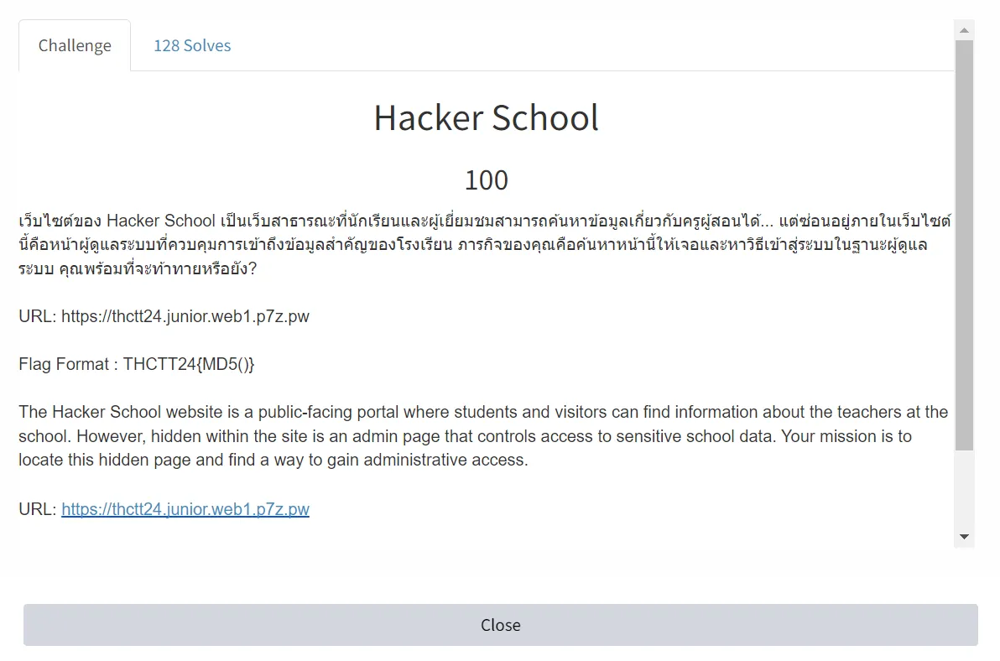

ถ้าตีความจากคำอธิบายโจทย์ก็จะได้ว่า ให้เราหาหน้าที่ถูกซ่อนไว้ให้เจอ เข้าสู่ระบบในฐานะผู้ดูแล แล้วเราจะเห็นข้อมูลสำคัญของโรงเรียน ซึ่งก็น่าจะหมายถึง FLAG ที่เรา**ต้องการ**

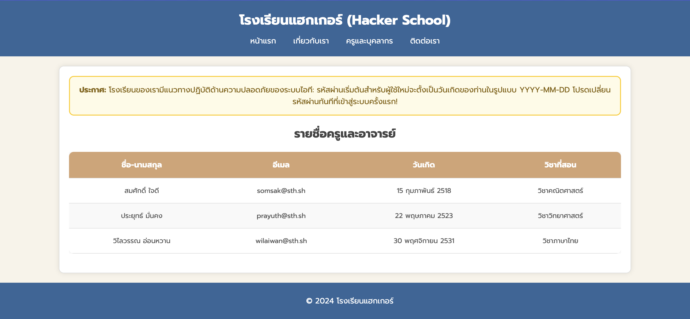

ซึ่งเมื่อเราเข้าเว็บไป เราจะเจอหน้านี้ ซึ่งมันจะโชว์รายชื่อครูและอาจารย์พร้อม อีเมล, วันเกิด, วิชาที่สอน

แล้วก็มีเตือนด้วยว่า

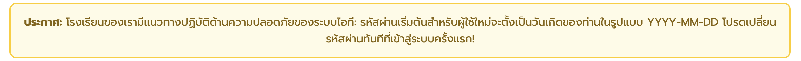

ซึ่งก็ง่ายเลย ถ้าครูยังไม่ได้เปลี่ยนรหัสผ่านจาก Default ที่ระบบตั้งมาให้

ซึ่งผมจะเลือกครูคนแรก เราจะได้รหัสผ่านเป็น `2518-02-15`

แต่!! เรายังไม่เจอหน้าที่โจทย์บอกว่ามันถูกซ่อนไว้เลยหนิ ผมก็จัดเลย Bruteforce ด้วย wordlist เล็กๆ ของ ffuf ก็น่าจะเจอ

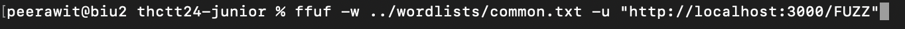

ถ้าไม่เจอหน้าที่เราหา มันจะส่ง Content-Length มา ขนาด 2784

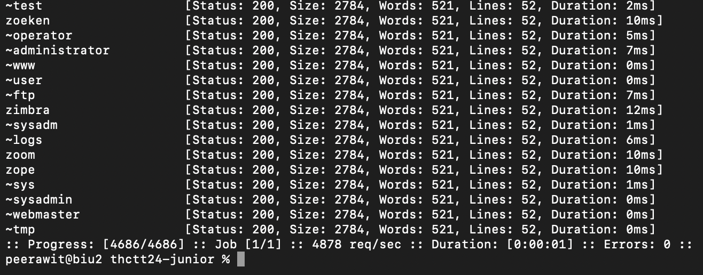

ผมก็เลย Filter ออก

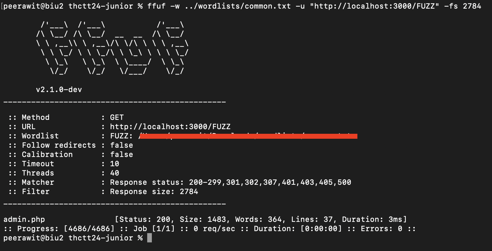

ก็จะเจอ หน้าที่ถูกซ่อนไว้คือ `admin.php`

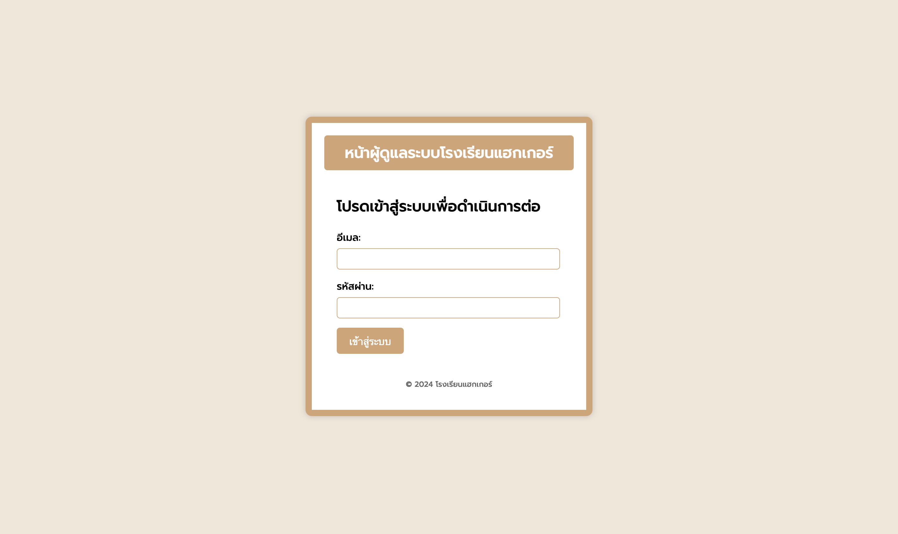

จริงๆ มันมีวิธีที่ง่ายกว่านี้ คือโจทย์บอกมาอยู่ แต่ผมไม่ได้ดู
คือ F12
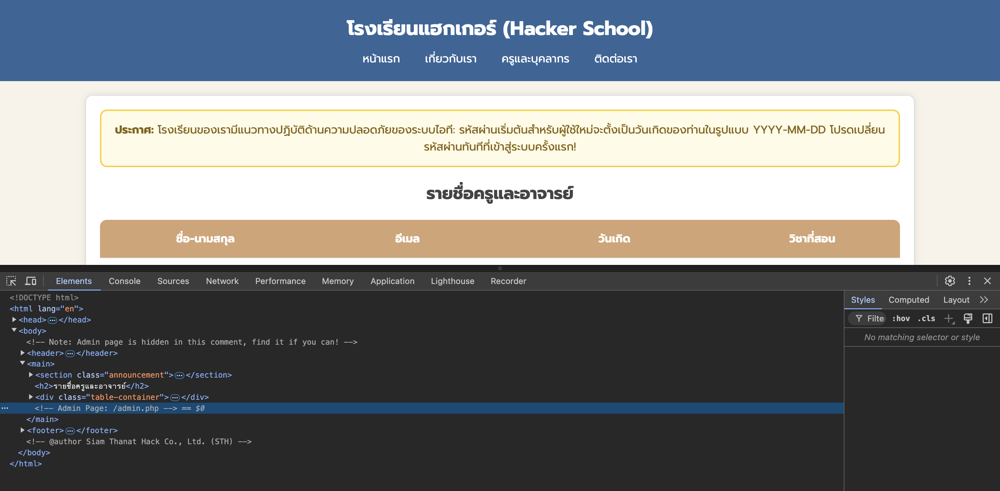

เย่~~ แต่การที่เราจะเข้าสู่ระบบได้ ก็คือเราต้องมีอีเมลด้วย


ซึ่งหน้าแรก ก็ให้อีเมลมาด้วย แบบนี้ก็หวานเจี๊ยบ
ผมเลือกคนแรก เลยได้อีเมลเป็น `somsak@sth.sh`

```
email: somsak@sth.sh
password: 2518-02-15
```

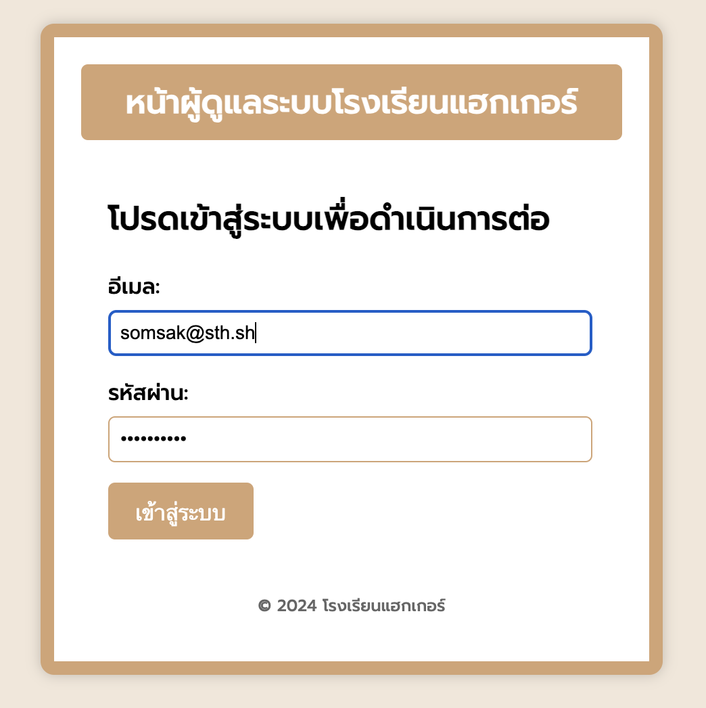

แต่มันดัน **ผิด!**

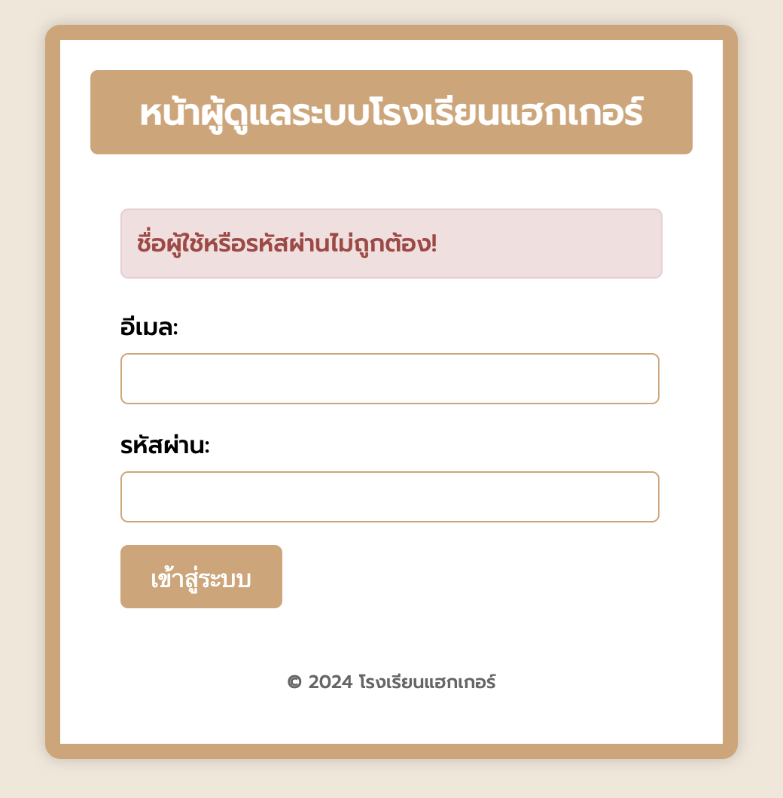

ผมก็เลยลองเปลี่ยนรหัสผ่าน จากเดิม ปี มันคือ พ.ศ. ผมเลย -543 ไป เพื่อให้มันกลายเป็น ค.ศ. จะได้รหัสใหม่เป็น `1975-02-15`

```
email: somsak@sth.sh
password: 1975-02-15
```

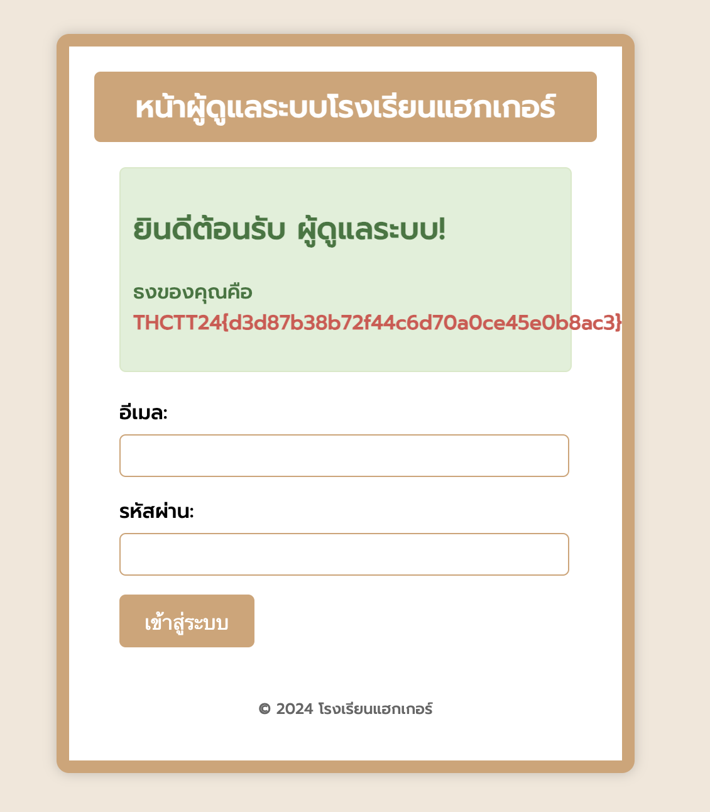

เย่่่่ FLAG ออกแล้ว `THCTT24{d3d87b38b72f44c6d70a0ce45e0b8ac3}`