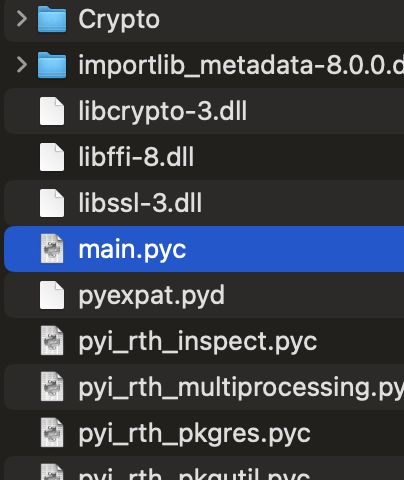

# Secplaysomware#1


คำถามแรก ถามว่า hash file นี้คือไร
```bash
% shasum -a256 Keygen.exe
b8af9cbd706c13f5e7f20573ff5f2894966c905835bd7c026b8c96f20e304c0b  Keygen.exe
```
ก็จะได้คำตอบเป็น `re{b8af9cbd706c13f5e7f20573ff5f2894966c905835bd7c026b8c96f20e304c0b}`

แต่ๆ เอาไปตอบนี่ผิดนะ แอดมินพึ่งมาเฉลย


ต้องเป็นตัวใหญ่นะค้าบ `re{B8AF9CBD706C13F5E7F20573FF5F2894966C905835BD7C026B8C96F20E304C0B}`

# Secplaysomware#2

โจทย์ให้หาว่าโปรแกรมนี้พัฒนาด้วยภาษาอะไร

```bash
% strings Keygen.exe
```

ผมก็เลยมา strings ส่องดูก่อน

```
...
bpywin32_system32\pywintypes312.dll
bselect.pyd
bucrtbase.dll
bunicodedata.pyd
bwin32\_win32sysloader.pyd
bwin32\win32api.pyd
bwin32\win32event.pyd
bwin32\win32evtlog.pyd
bwin32\win32process.pyd
bwin32\win32security.pyd
bwin32\win32trace.pyd
bwin32com\shell\shell.pyd
opyi-contents-directory _internal
zPYZ-00.pyz
MEI
```

`.pyd` ???


อะห้าาา `python` แน่ทรงนี้

`re{python}`

# Secplaysomware#3

โจทย์ให้หาว่า ไฟล์ที่ถูก encrypt จะใช้นามสกุลอะไร

ผมจะใช้เป็น [pyinstxtractor](https://github.com/extremecoders-re/pyinstxtractor) ในการ extract โครงสร้างของโปรแกรมนี้

```bash
% python3 pyinstxtractor-master/pyinstxtractor.py Keygen.exe
[+] Processing Keygen.exe
[+] Pyinstaller version: 2.1+
[+] Python version: 3.12
[+] Length of package: 16570000 bytes
[+] Found 136 files in CArchive
[+] Beginning extraction...please standby
[+] Possible entry point: pyiboot01_bootstrap.pyc
[+] Possible entry point: pyi_rth_inspect.pyc
[+] Possible entry point: pyi_rth_pkgutil.pyc
[+] Possible entry point: pyi_rth_multiprocessing.pyc
[+] Possible entry point: pyi_rth_setuptools.pyc
[+] Possible entry point: pyi_rth_pkgres.pyc
[+] Possible entry point: pyi_rth_pywintypes.pyc
[+] Possible entry point: pyi_rth_pythoncom.pyc
[+] Possible entry point: main.pyc
[+] Found 571 files in PYZ archive
[+] Successfully extracted pyinstaller archive: Keygen.exe

You can now use a python decompiler on the pyc files within the extracted directory
```

เราจะได้ `main.pyc` ซึ่งมันคือ python ที่ถูก compile มาเป็น bytecode



ซึ่งผมก็ขี้เกียจไปโหลด tool มาเพิ่ม

เลยขอยาดดดด


ไปเจอตัวนี้ [pylingual.io](https://pylingual.io/)

เจ๋งงง


กลับมาที่โจทย์ `ไฟล์ที่ถูก encrypt จะใช้นามสกุลอะไร`


อันนี้ไม่แน่ใจว่าตอบ `re{.qwerty}` หรือ `re{qwerty}` สักอันแหละ

# Secplaysomware#4


หลังจาก ransomware นี้รันแล้ว จะสร้างไฟล์ชื่ออะไร


อันนี้ก็ไม่แน่ใจว่าตอบ `re{UNLOCK_README.txt}` มั้ย ใช่แหละ

# Secplaysomware#5

ให้หา IV ที่ใช้ในการ encrypt


นั่นแหละท่านผู้ชม

`re{secplaygroundgod}`